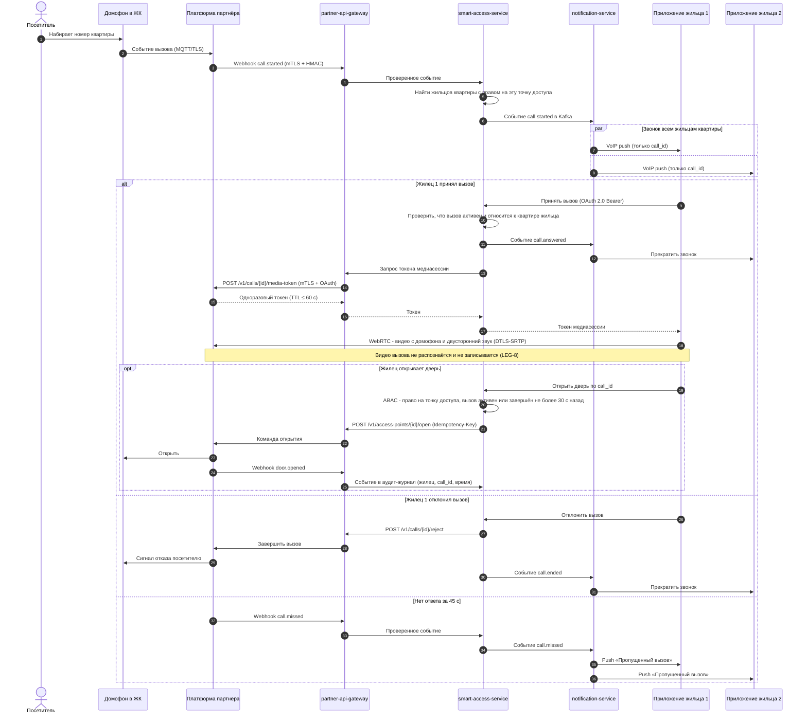

# Задание 3. Внешние интеграции: сервисы «Умный дом»

## Состав решения

| Файл | Содержание |
| --- | --- |
| [smart_home_context_c4.drawio](smart_home_context_c4.drawio) | Диаграмма контекста C4 (уровень 1) для новых бизнес-функций |
| [PropDevelopment_C4_containers_smart_home.drawio](PropDevelopment_C4_containers_smart_home.drawio) | Доработанная диаграмма контейнеров PropDevelopment. Новые и изменённые элементы выделены оранжевым |
| Этот файл | Ключевые решения, требования к безопасности, протоколы аутентификации и авторизации, организация взаимодействия |

Новые бизнес-функции:
- **Интеллектуальный домофон** — видеовызов с открытием двери из приложения и автоматическое открытие по распознаванию лица.
- **Интеллектуальный шлагбаум** — классическое управление и автоматический въезд по распознаванию госномера.

Обе функции доступны собственникам через текущее мобильное приложение.

## 1. Изменения в ландшафте систем

| Элемент | Тип изменения | Назначение                                                                                                                                                                                                                                                  |
| --- | --- |-------------------------------------------------------------------------------------------------------------------------------------------------------------------------------------------------------------------------------------------------------------|
| **smart-access-service** (Kotlin, Spring Boot) | Новый контейнер | Единственная точка, где PropDevelopment хранит и проверяет права доступа: кто, в какой подъезд и на какой шлагбаум, какие автомобили. Синхронизирует права с партнёром, принимает события, управляет сессией видеовызова, проверяет каждую команду открытия |
| **smart-access-db** (PostgreSQL) | Новый контейнер | Точки доступа ЖК, права жильцов, госномера (шифрование на уровне полей), согласия, журнал событий. **Биометрия не хранится**                                                                                                                                |
| **partner-api-gateway** (API Gateway) | Новый контейнер | Единая точка обмена со всеми партнёрскими системами. Отвечает за mTLS, проверку токенов и подписи webhook, валидацию схемы, rate limiting и аудит.                                                                                                          |
| **smart-home-events** (Kafka) | Новый контейнер | Шина событий: вызовы, проходы, въезды, изменения прав. Развязывает приём событий от уведомлений и аналитики                                                                                                                                                 |
| **notification-service** (Kotlin, Spring Boot) | Новый контейнер | Push и VoIP-уведомления через APNs/FCM. Входящий вызов домофона должен «разбудить» приложение                                                                                                                                                               |
| **auth-service-1** (Keycloak) | Изменён | Добавлен realm `owners` для собственников и жильцов: OIDC + PKCE, MFA, token exchange. Реестр пользователей отделён от покупателей, но управляется одним сервисом                                                                                           |
| **Витрина сервисов для собственников** (iOS/Android) | Изменена | Разделы «Домофон» и «Шлагбаум»: управление жильцами и автомобилями, приём видеовызовов, открытие                                                                                                                                                            |
| **CRM собственников** | Используется по-новому | Мастер-источник сведений о том, кто владеет квартирой. smart-access-service получает отсюда собственников и квартиры и реагирует на смену собственника                                                                                                      |
| **Хранилище данных** | Используется по-новому | Получает только обезличенные события доступа, без биометрии и госномеров (не через CDC сырых таблиц)                                                                                                                                                        |
| Платформа «Умный дом» партнёра, оборудование в ЖК, APNs/FCM | Новые внешние системы | Партнёр отвечает за распознавание, хранение биометрических шаблонов, управление устройствами и медиасервер видеовызовов                                                                                                                                     |

### Ключевые архитектурные решения

1. **Биометрия обрабатывается только у партнёра.** Фото лица при регистрации проходит через smart-access-service потоком, без сохранения, и уходит в API партнёра. PropDevelopment хранит только идентификатор шаблона (`face_template_id`). Так в контуре компании не появляется новая категория секретных данных, и снижаются требования к защите собственных систем.
2. **Партнёр не получает ФИО и контакты.** Жилец передаётся партнёру под псевдонимом (`resident_id`, UUID). Достаточно связки «псевдоним — точка доступа — шаблон лица / госномер».
3. **Решение об открытии по распознаванию принимается на стороне партнёра** по синхронизированному списку разрешений. Это быстрее и работает при недоступности систем PropDevelopment. **Решение об открытии из приложения принимает smart-access-service** — команда уходит партнёру только после проверки прав.
4. **Видеопоток идёт напрямую** между медиасервером партнёра и приложением (WebRTC). Бэкенд PropDevelopment не пропускает через себя медиатрафик и не хранит видео. Он только выдаёт одноразовый токен на сессию.
5. **Все обмены с партнёром — только через partner-api-gateway.** Прямые вызовы партнёрских API из прикладных сервисов запрещены.

## 2. Требования к безопасности

### 2.1. Правовые требования

| ID | Требование | Обоснование |
| --- | --- | --- |
| LEG-1 | Изображение лица, используемое для идентификации, обрабатывается как биометрические ПД: только при наличии **отдельного письменного согласия** (в том числе в форме электронного документа с ЭП) | ст. 11 и ч. 4 ст. 9 152-ФЗ |
| LEG-2 | До запуска провести юридическую экспертизу сценария распознавания жильцов на соответствие 572-ФЗ (о Единой биометрической системе). По её итогам выбрать допустимую схему: собственная система партнёра или ЕБС | 572-ФЗ ограничивает обработку биометрии для идентификации вне ЕБС |
| LEG-3 | Распознавание лица и номера — только по желанию пользователя (opt-in). Отказ от биометрии не ограничивает доступ: всегда доступны открытие из приложения, вызов, ключ | Добровольность согласия, запрет обусловливать услугу согласием на биометрию |
| LEG-4 | С партнёром заключается договор поручения обработки ПД. В нём указаны перечень ПД, цели, требования к защите по ст. 19, обязанность уведомлять об инцидентах, удалять данные и допускать аудит | ч. 3 ст. 6 152-ФЗ |
| LEG-5 | ПД граждан РФ, включая биометрические шаблоны и видео, записываются и хранятся в базах данных на территории РФ, в том числе у партнёра | ч. 5 ст. 18 152-ФЗ |
| LEG-6 | smart-access-service, smart-access-db и система партнёра включаются в реестр ИСПДн. Определяется уровень защищённости и реализуются меры по приказу ФСТЭК № 21 | ПП РФ № 1119 |
| LEG-7 | Госномер в связке с жильцом считается ПД. Видео с камер общих зон используется и передаётся только в пределах целей обработки | 152-ФЗ |
| LEG-8 | Видео и звук вызова домофона передаются только жильцу, принявшему вызов, и нужны только для решения об открытии. Лица и голоса посетителей не распознаются, вызовы и снимки посетителей не записываются ни у PropDevelopment, ни у партнёра. Распознавание применяется только к жильцам, давшим согласие (LEG-1, FLOW-4) | Посетитель не давал согласия на обработку своих биометрических ПД (ст. 11 152-ФЗ) |

### 2.2. Минимизация персональных данных

| ID | Требование |
| --- | --- |
| DATA-1 | Партнёру передаётся только: `resident_id` (псевдоним), идентификаторы точек доступа, период действия права, госномер, фото лица для регистрации шаблона. ФИО, телефон, e-mail, номер квартиры не передаются |
| DATA-2 | Контракт API (OpenAPI 3) проходит ревью ИБ до подключения. Шлюз отклоняет запросы и ответы с полями вне схемы (строгая валидация, `additionalProperties: false`) |
| DATA-3 | Фото лица не сохраняется в системах PropDevelopment: ни в БД, ни в журналах, ни во временных файлах. Передаётся потоком в API партнёра |
| DATA-4 | Госномера в smart-access-db шифруются на уровне полей. Для поиска используется HMAC-хеш |
| DATA-5 | В DWH передаются только обезличенные события (псевдонимизированный ID, точка доступа, тип и время события). Биометрия, госномера и видео в DWH не попадают |
| DATA-6 | Сроки хранения: журнал событий — не дольше обоснованного срока (например, 1 год), видео у партнёра — по договору (например, 30 дней), снимки распознавания не хранятся после принятия решения |
| DATA-7 | При отзыве согласия, выезде жильца или смене собственника шаблон лица и госномера удаляются у партнёра. Партнёр подтверждает удаление в API. Срок — не более 24 часов, а доступ отзывается сразу (см. FLOW-6) |

### 2.3. Изоляция и контроль доступа

| ID | Требование |
| --- | --- |
| ACC-1 | Каждая команда открытия и каждое изменение прав проверяется в smart-access-service по атрибутам (ABAC): пользователь, роль (собственник / жилец / гость), квартира, дом, точка доступа, срок действия права. Защита от IDOR/BOLA: идентификаторы из запроса всегда сверяются с правами владельца токена |
| ACC-2 | Собственник управляет жильцами и автомобилями только своей квартиры. Жилец не может приглашать других и менять чужие права |
| ACC-3 | Учётная запись партнёра ограничена ЖК, обслуживаемыми по договору: OAuth-scope и claim `estates`. Запрос к объекту чужого ЖК отклоняется на шлюзе и в сервисе |
| ACC-4 | Менеджеры УК администрируют точки доступа через SSO компании (AD) с MFA и правами только на свои ЖК. Все действия журналируются |
| ACC-5 | Привилегированные операции (регистрация лица, добавление автомобиля, приглашение жильца, выдача постоянного доступа) требуют step-up аутентификации: повторный вход или второй фактор |

### 2.4. Криптографическая защита

| ID | Требование |
| --- | --- |
| CRY-1 | Весь внешний трафик — только TLS 1.2+ (предпочтительно 1.3) с современными наборами шифров. Внутренний трафик (REST, Kafka, JDBC) тоже шифруется |
| CRY-2 | Взаимная аутентификация с партнёром — mTLS с сертификатами из доверенного УЦ. Ротация сертификатов не реже раза в год, процедура отзыва согласована |
| CRY-3 | Секреты (ключи HMAC, client secret, ключи шифрования полей) хранятся в Vault/KMS, ротируются, в коде и конфигурации отсутствуют |
| CRY-4 | Видеопоток шифруется (WebRTC DTLS-SRTP). Одноразовый токен медиасессии живёт не дольше 60 секунд и привязан к пользователю и вызову |
| CRY-5 | Если для уровня защищённости ИСПДн требуются сертифицированные СКЗИ, на каналах с партнёром используется ГОСТ TLS |

### 2.5. Журналирование, мониторинг, инциденты

| ID | Требование |
| --- | --- |
| LOG-1 | Аудит-журнал каждой команды открытия и изменения прав: кто, когда, точка доступа, источник (приложение, распознавание, менеджер), результат. Журнал защищён от изменения |
| LOG-2 | В журналах нет токенов, биометрии и фото. Госномера маскируются |
| LOG-3 | События шлюза и smart-access-service отправляются в SIEM. Алерты: всплеск отказов авторизации, команды открытия по чужим точкам, аномальная частота открытий, невалидные подписи webhook |
| LOG-4 | Партнёр уведомляет PropDevelopment об инцидентах с ПД не позднее чем через **12 часов**. Так компания успевает уведомить Роскомнадзор в течение 24 часов (ч. 3.1 ст. 21 152-ФЗ) |

### 2.6. Требования к партнёру

| ID | Требование |
| --- | --- |
| PRT-1 | Подтверждённое соответствие 152-ФЗ и мерам ФСТЭК для своей ИСПДн. Отчёт о пентесте платформы и мобильного SDK не старше 12 месяцев |
| PRT-2 | Изоляция данных клиентов партнёра (multi-tenancy): данные PropDevelopment недоступны другим заказчикам |
| PRT-3 | Распознавание лиц с проверкой «живости» (liveness), чтобы фото или видео на экране не открывали дверь. Подтверждённые показатели ошибок FAR и FRR |
| PRT-4 | Устройства в ЖК: защищённая загрузка, подписанные обновления прошивки, отсутствие паролей по умолчанию, связь с облаком только по TLS/MQTT с сертификатом устройства |
| PRT-5 | Право PropDevelopment на аудит. Выгрузка и удаление всех данных при расторжении договора |

### 2.7. Отказоустойчивость и физическая безопасность

| ID | Требование |
| --- | --- |
| RES-1 | При недоступности PropDevelopment оборудование продолжает пропускать по кешированному списку разрешений. При недоступности облака партнёра работает локальный режим: классический домофон, ключи, ручное открытие шлагбаума |
| RES-2 | При пожарной тревоге двери открываются для эвакуации (fail-open) независимо от интеграции |
| RES-3 | Отзыв доступа приоритетнее доступности: при сбое синхронизации отзыва срабатывает повтор с алертом, а в кеше устройства у права есть срок действия |
| RES-4 | Удалённое открытие из приложения выполняется с задержкой не более 2 секунд (p95), вызов доставляется на устройство за 3 секунды (p95) |

## 3. Протоколы аутентификации и авторизации

| Взаимодействие | Аутентификация | Авторизация | Токены и детали |
| --- | --- | --- | --- |
| Мобильное приложение → smart-access-service | **OpenID Connect, Authorization Code + PKCE** (RFC 7636) через auth-service-1, realm `owners`. Первый вход — пароль и второй фактор (SMS/TOTP). Повторные входы — refresh token из защищённого хранилища ОС (Keychain / Keystore), доступ к нему подтверждается биометрией устройства (Face ID / отпечаток). Биометрия не покидает устройство | **OAuth 2.0 Bearer** (JWT, проверка подписи по JWKS). Scopes `access:read`, `access:manage`, `door:open`. ABAC в сервисе по атрибутам пользователя | Access token живёт 5–10 минут, refresh token ротируется. Привязка токена к устройству через DPoP (RFC 9449). Step-up (`acr`) для привилегированных операций |
| Приложение → медиасервер партнёра (видео) | Одноразовый токен медиасессии, выданный партнёром по запросу smart-access-service (паттерн token exchange) | Токен действует только для одного вызова и одной точки доступа | Срок жизни не больше 60 секунд, одноразовый. WebRTC DTLS-SRTP |
| smart-access-service → партнёр (через шлюз) | **mTLS** (сертификат PropDevelopment) + **OAuth 2.0 Client Credentials** у сервера авторизации партнёра | Scopes `identities:write`, `access-rules:write`, `commands:open`. Изоляция на стороне партнёра: `client_id` PropDevelopment привязан к учётной записи заказчика (claim `tenant_id`), партнёр на каждом запросе проверяет принадлежность точки доступа и жильца этому заказчику (PRT-2). smart-access-service отправляет команды только по точкам доступа из своего реестра (ACC-1) | Access token привязан к сертификату (RFC 8705), живёт не больше 15 минут. Ключ идемпотентности для каждой команды |
| Партнёр → PropDevelopment (webhooks через шлюз) | **mTLS** (сертификат партнёра, allowlist IP) + **HMAC-SHA256-подпись** тела запроса с меткой времени | Шлюз пропускает только описанные типы событий на `/partner/smart-home/events`. Сервис проверяет, что событие относится к ЖК партнёра | Окно метки времени не больше 5 минут, защита от повторов по `event_id` |
| smart-access-service → auth-service-1, CRM | Сервисная учётная запись: OAuth 2.0 Client Credentials во внутреннем Keycloak, mTLS внутри кластера | Только чтение собственников, квартир и жильцов | — |
| Менеджер УК → консоль администрирования | SSO через Keycloak, федерированный с Active Directory, с обязательной MFA | RBAC-роль `estate-access-admin` + ограничение по ЖК (ABAC) | Сессия не дольше 8 часов, повторная аутентификация для массовых операций |
| notification-service → APNs / FCM | APNs — JWT-токен провайдера (ключ .p8), FCM — сервисный аккаунт OAuth 2.0 | — | В push нет ПД — только идентификатор вызова, данные запрашиваются из приложения |
| Устройства ЖК → облако партнёра | Сертификат устройства (mTLS), выданный при установке | Ответственность партнёра (PRT-4) | — |

## 4. Организация взаимодействия с внешней платформой

### 4.1. Принципы интеграции

- **Стиль:** синхронный REST для команд и управления правами (PropDevelopment → партнёр), асинхронные webhooks для событий (партнёр → PropDevelopment), внутри компании — Kafka.
- **Контракт:** OpenAPI 3 и AsyncAPI для событий. Версионирование в пути (`/v1/`), обратная совместимость в пределах мажорной версии, уведомление о выводе версии не менее чем за 3 месяца.
- **Надёжная отправка:** изменения прав сначала записываются в smart-access-db, затем отправляются партнёру через **transactional outbox**. Повторы с экспоненциальной задержкой, circuit breaker, DLQ с алертом.
- **Идемпотентность:** каждая команда и событие несут уникальный ID (`Idempotency-Key`, `event_id`), повторная обработка не меняет результат.
- **Сверка:** ежедневная полная сверка списков разрешений (reconciliation) между smart-access-db и партнёром, расхождения фиксируются как инцидент.

### 4.2. Основные сценарии

| ID | Сценарий | Последовательность |
| --- | --- | --- |
| FLOW-1 | Подключение ЖК | Менеджер УК регистрирует точки доступа (подъезды, шлагбаумы) в консоли, получает их ID у партнёра. Права собственников создаются автоматически по данным CRM |
| FLOW-2 | Регистрация лица | Приложение → step-up аутентификация → электронное согласие (фиксируется в smart-access-db) → фото с проверкой liveness передаётся потоком через smart-access-service и шлюз партнёру → партнёр возвращает `face_template_id` → сервис сохраняет связку и публикует событие |
| FLOW-3 | Добавление автомобиля | Приложение → госномер проверяется по формату, шифруется и сохраняется → партнёру отправляется правило «госномер → шлагбаумы ЖК → срок действия» |
| FLOW-4 | Автоматический проход или въезд | Устройство → облако партнёра распознаёт лицо или номер и сверяет с кешированным правилом → открытие → webhook события → шлюз → smart-access-service → Kafka → notification-service → push владельцу (опционально) |
| FLOW-5 | Вызов домофона и открытие из приложения | Посетитель набирает номер квартиры → партнёр присылает `call.started` → smart-access-service находит жильцов квартиры с правом на эту точку доступа → VoIP-push всем им (только `call_id`) → первый принявший вызов получает одноразовый токен и видео напрямую от партнёра, у остальных звонок прекращается → команда «Открыть» проверяется по ABAC и разрешена только для активного вызова этой квартиры или в течение 30 секунд после его завершения → команда открытия с ключом идемпотентности → `door.opened` в аудит-журнал. Другие исходы: жилец отклонил вызов — вызов завершается у всех; нет ответа за 45 секунд — `call.missed` и push «Пропущенный вызов». Видео вызова не распознаётся и не записывается (LEG-8). Подробнее — на диаграмме в разделе 4.3 |
| FLOW-6 | Отзыв доступа | Смена собственника в CRM / удаление жильца / отзыв согласия → smart-access-service отзывает права (отзыв доступа — сразу, удаление биометрии — в течение 24 часов, см. DATA-7) → команда партнёру с приоритетом → подтверждение удаления шаблона → запись в аудит |
| FLOW-7 | Гостевой доступ | Собственник выдаёт временное право (одноразовый код или госномер с интервалом действия). Право истекает автоматически, у партнёра — тоже по сроку |

### 4.3. Диаграмма последовательности: вызов домофона (FLOW-5)

Для примера в квартире двое жильцов с правом на эту точку доступа.

### 4.4. Эксплуатация интеграции

| Аспект | Требование |
| --- | --- |
| Окружения | Отдельный sandbox партнёра с эмулятором устройств для разработки и тестов. Продуктивные ПД в тестовых средах не используются |
| SLA партнёра | Доступность API не ниже 99,9 %, время реакции на критический инцидент не больше 30 минут, плановые работы — с уведомлением за 5 рабочих дней |
| Мониторинг | Метрики шлюза и сервиса: задержка и ошибки по каждой операции партнёра, глубина outbox и DLQ, время доставки вызова, расхождения сверки |
| Ограничение нагрузки | Rate limit на шлюзе для каждого партнёра и операции, защита от шторма webhook |
| Тестирование безопасности | DAST и пентест API перед запуском и при каждом мажорном изменении контракта, в том числе на IDOR/BOLA (OWASP API Security Top 10) |
| Изменения | Любое изменение контракта, нового типа данных или нового партнёра проходит обязательный security review специалиста по ИБ (закрывает проблему из задания 2) |
